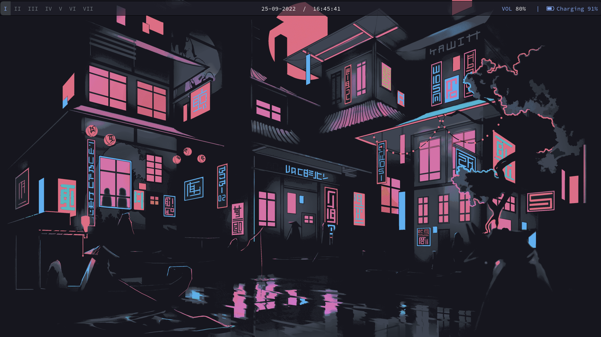
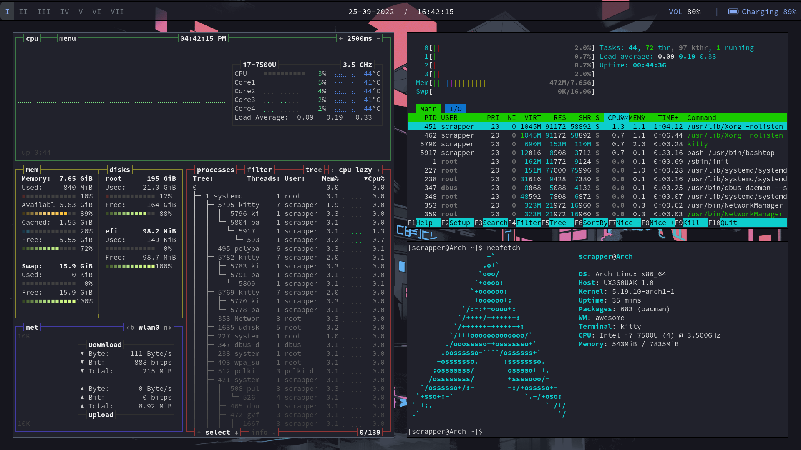

# AwesomeWM Dotfiles

Arch Linux & AwesomeWM Dotfiles! 

## Information

- **OS:** [Arch Linux](https://archlinux.org)
 
- **WM:** [AwesomeWM](https://github.com/awesomeWM/awesome)

- **Bar:** [Polybar](https://github.com/polybar/polybar)

- **Terminal:** [Kitty](https://github.com/kovidgoyal/kitty)

- **Text Editor:** [Visual Studio Code](https://github.com/microsoft/vscode)
                   , [NeoVim](https://github.com/neovim/neovim)

- **Discord Theme:** [Blue Darker](https://github.com/Keyitdev/BetterDiscord-themes)
 
- **Application Launcher:** [Rofi](https://github.com/davatorium/rofi)

- **Lockscreen:** [BetterLockScreen](https://github.com/betterlockscreen/betterlockscreen)

<a href="docs/init.md" rel="noreferrer noopener">docs here</a>